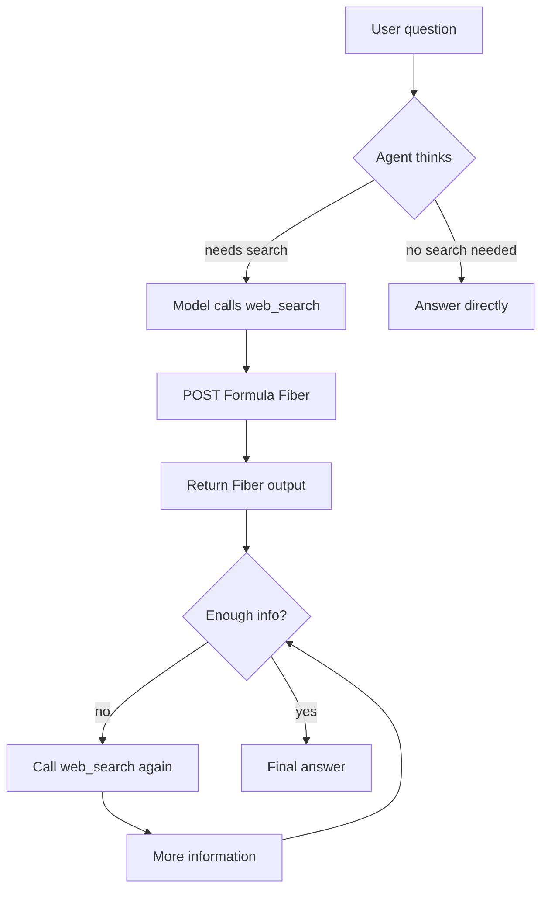

# Kimi Web Search Agent / Kimi 网络搜索 Agent

回答一个需要新信息的问题时，模型往往不能一步结束：它先决定查什么，读到结果后再决定是否继续查。本实验用一条可见的搜索轨迹，解释“思考、行动、观察”怎样组成 Agent 循环。

[English](#english)

建议按以下顺序阅读：[理解问题与方法](#learning-0) → [准备环境与输入](#learning-1) → [按照步骤完成实验](#learning-2) → [分析结果与形成判断](#learning-3) → [阅读实现与继续探索](#learning-4) → [排查问题与查阅资料](#learning-5)。

<a id="learning-0"></a>

<a id="中文"></a>

## 理解问题与方法

用户问题进入对话后，模型可以提出工具调用。程序执行工具，把结果作为新的消息交回模型，随后开始下一轮。离线演示使用预先写好的轨迹，让你先看清控制流；真正联网时，搜索结果由 Moonshot 的 Formula 服务返回。

### 这个实验做什么

对应书中**实验 1-2 ★：Kimi K3 原生 Agent 能力**。模型收到问题后，可以调用搜索工具，
读取结果，再决定继续搜索还是回答。这个过程就是本章介绍的 ReAct 循环。

### 联网时发生了什么

当前代码通过 Moonshot 的 Formula 接口使用 `web_search`。你不需要先读懂全部接口，
只需跟踪三步：

1. 程序向服务端获取搜索工具的定义，并把定义交给模型。
2. 模型决定搜索时，程序把它给出的工具名和参数交给 Formula 执行。
3. 工具执行成功后，程序把结果放回对话，让模型继续处理问题。

搜索在 Moonshot 服务端执行。遇到错误时，先看日志区分是获取工具定义、执行搜索还是模型请求失败。
服务的使用条件见 [官方工具说明](https://platform.kimi.ai/docs/guide/use-official-tools)。
如果暂时无法联网，可以继续用上面的离线演示学习流程。

### 怎样检查答案

一次联网问答完成后，检查轨迹里是否实际调用了 `web_search`，工具是否返回成功，以及最终答案是否使用了
这些结果。每次提问都会重置对话历史，所以上一个问题中的信息不会自动保留到下一个问题。
搜索成功也不保证答案完整或准确；可以对照结果来源检查模型是否遗漏或误读了信息。

### 开发计划（尚未实现）

- [ ] 添加异步搜索支持（使用 aiohttp）
- [ ] 实现搜索结果缓存机制
- [ ] 支持更多搜索后端（通过 `search_impl` 扩展）
- [ ] 支持多语言搜索
- [ ] 添加搜索结果质量评分
- [ ] 实现搜索历史记录
- [ ] 集成重试机制（使用 tenacity）
- [ ] 优化长对话的上下文管理

### 相关链接

- [Kimi API 文档](https://platform.moonshot.ai/docs)
- [Web 搜索工具文档](https://platform.moonshot.ai/docs/guide/use-web-search)
- [Moonshot AI 平台](https://platform.moonshot.ai/)

---

---

<a id="learning-1"></a>

## 准备环境与输入

先从本地示例开始。依赖安装可能需要联网，但下面标明的离线路径不需要模型 API Key。若随后切换到真实模型，请再完成相应的服务配置。

### 配置选项

| 配置项 | 说明 | 默认值 |
|--------|------|--------|
| `MOONSHOT_API_KEY` | Moonshot AI API 密钥 | 必填 |
| `KIMI_API_KEY` | 旧版 API 密钥变量名（向后兼容） | 可选 |
| `KIMI_BASE_URL` | API 基础 URL | `https://api.moonshot.cn/v1` |
| `DEFAULT_MODEL` | 默认模型 | `kimi-k3` |
| `MAX_SEARCH_ITERATIONS` | 最大搜索迭代次数（Config 中设置） | 5 |
| `SEARCH_TIMEOUT` | 单次请求超时（秒），同时作用于 Formula 工具调用与 chat completion | 180 |
| `temperature` | 控制生成内容的创造性 | 0.6 |

<a id="learning-2"></a>

## 按照步骤完成实验

先运行下方离线命令，不需要模型凭据。按顺序阅读终端输出，再打开 `demo.json`，把 `trace` 中的步骤与最终 `answer` 对照。理解后，按下文配置联网模式，在另一个问题上观察模型是否真的发起了搜索。

### 先做一个小规模观察

以下命令从本实验目录执行。先完成前面的环境准备，再观察这条路径的输入和输出。

```bash
python main.py --provider offline-demo --output demo.json
```

### 快速开始

#### 1. 安装依赖

```bash
# 推荐在仓库根目录使用统一的第 1 章环境
uv sync --locked --extra ch1

# 切换目录前先激活环境：
# macOS/Linux：
source .venv/bin/activate
# Windows PowerShell：.venv\Scripts\Activate.ps1
# Windows cmd：.venv\Scripts\activate.bat

# 未安装 uv 时可用 pip 兜底：
# python -m pip install -e ".[ch1]"

# 进入本实验目录，后续命令都在这里运行
cd chapter1/web-search-agent

# 迁移期间仍支持单项目兼容路径：
# python -m pip install -r requirements.txt
```

#### 2. 配置 API Key

从 [Moonshot AI 平台](https://platform.moonshot.ai/) 获取 API Key，然后设置环境变量：

```bash
export MOONSHOT_API_KEY='your-api-key-here'
```

或创建 `.env` 文件：

```env
MOONSHOT_API_KEY=your-api-key-here
```

**注意**: 为了向后兼容，系统也支持使用 `KIMI_API_KEY` 环境变量。

**通用兜底（OpenRouter）**: 若未设置 `MOONSHOT_API_KEY`/`KIMI_API_KEY` 但设置了 `OPENROUTER_API_KEY`，请求会自动改走 OpenRouter。请求的模型 id 会被映射为 OpenRouter 等价 id（默认的 `kimi-k3` 会变成 `moonshotai/kimi-k2.6`）；仅当**未指定模型**时才使用 `OPENROUTER_MODEL`（默认 `openai/gpt-5.6-luna`）。

**重要限制**：Kimi 内置的 `web_search` 工具是 Moonshot 专有能力，在 OpenRouter 上不可用——因此兜底模式下模型仅凭自身知识作答，**没有实时联网搜索**。如需真正的联网搜索，请使用 Moonshot 主 key。

#### 3. 运行 Agent

`main.py` 提供了完整的命令行接口（中文帮助）。查看全部参数：

```bash
python main.py --help
```

| 参数 | 说明 | 默认值 |
|------|------|--------|
| `query` | 要提问的问题（位置参数）；省略则进入交互模式 | 无 |
| `--provider` | 搜索后端：`kimi`（调用内置 `web_search`，需 API Key）/ `offline-demo`（离线示例轨迹） | `kimi` |
| `--model` | 模型名称 | `kimi-k3` |
| `--max-steps` | 最大 ReAct 迭代次数 | `5` |
| `--base-url` | API 基础 URL | `https://api.moonshot.cn/v1` |
| `--api-key` | Kimi API Key（默认读环境变量） | 环境变量 |
| `--output`, `-o` | 将问题、ReAct 轨迹与答案保存为 JSON | 无 |
| `--quiet` | 不实时打印 ReAct 轨迹 | 打印 |

**离线演示 ReAct 循环**（无需 API Key，回放示例轨迹，直观展示“想→做→看”）：

```bash
python main.py --provider offline-demo
```

**交互模式**（每次提问独立，`search_and_answer` 会重置对话历史，无跨问题上下文）：

```bash
python main.py
```

**单次问答**（运行时逐步打印思考/行动/观察轨迹）：

```bash
python main.py "2024年诺贝尔物理学奖获得者是谁？"
python main.py "比特币现价" --max-steps 3 --output result.json
```

**快速体验**（引导式交互）：

```bash
python quickstart.py
```

**高级示例**：

```bash
python examples.py
```

> 运行时会实时打印 **ReAct 轨迹**：💭 思考 → 🔧 行动（调用 `web_search`）→ 👀 观察（搜索结果）→ ✅ 最终答案，对应本章讲的“想→做→看”循环。`agent.get_trace()` 可获取结构化轨迹，`--output` 可将其存为 JSON。

### 使用示例

#### 基础使用

```python
from agent import WebSearchAgent
from config import Config

# 创建 Agent
agent = WebSearchAgent(api_key=Config.get_api_key())

# 提问并获取答案
question = "Python 3.12 有哪些新特性？"
answer = agent.search_and_answer(question)
print(answer)
```

#### 高级功能

```bash
python examples.py
```

包含：

- **批量搜索**：同时搜索多个问题
- **带上下文搜索**：提供背景信息进行更精准的搜索
- **比较搜索**：搜索并比较多个项目
- **事实核查**：验证陈述的真实性
- **研究助手**：深度研究某个主题

### 使用建议

1. **明确问题**: 提供清晰、具体的问题以获得更好的答案
2. **提供上下文**: 必要时提供背景信息帮助 Agent 理解
3. **迭代优化**: 如果答案不满意，可以提供更多细节重新提问
4. **合理期望**: Agent 基于搜索结果回答，可能无法回答所有问题

<a id="learning-3"></a>

## 分析结果与形成判断

离线输出证明的是流程可以展示，不是搜索服务已经连通。联网运行时，要同时检查工具执行状态、返回内容和答案引用。模型可能直接回答而不调用工具；此时应根据问题是否需要外部信息判断它的选择是否合理。

### 检查自己的解释

如果搜索结果互相矛盾，循环应继续搜索、向用户澄清，还是带着不确定性回答？

<a id="learning-4"></a>

## 阅读实现与继续探索

### 项目说明

> Autonomous ReAct web-search agent on Kimi K3 using Moonshot's official Formula API (multi-round search + synthesis).
> 配套《深入理解 AI Agent》第 1 章 **实验 1-2 ★：Kimi K3 原生 Agent 能力**。

← [Chapter 1 index / 返回第 1 章目录](../README.md) · 📖 [Read the chapter / 读本章正文](../../book/chapter1.md)（[EN](../../book-en/chapter1.md)）

---

[中文说明](#中文) · [English](#english)

### 核心组件

#### `agent.py` — 核心 Agent 实现

- `WebSearchAgent`: 主要的 Agent 类
- `search_and_answer()`: 执行 ReAct 循环并生成答案的主方法
- `get_trace()`: 返回上一次运行的结构化 ReAct 轨迹（思考/行动/观察/最终答案）
- `_chat()`: 与 Kimi API 进行对话交互
- `_get_system_prompt()`: 获取系统提示，定义 Agent 行为
- `_get_tools()`: 定义可用的工具（`web_search`）
- `search_impl()`: 搜索实现的抽象层，便于扩展
- `format_trace_step()`: 将一条轨迹步骤渲染为可读文本
- `run_offline_demo()`: 离线回放示例轨迹，无需 API Key 即可演示 ReAct 循环

#### `config.py` — 配置管理

- API 配置
- 模型选择
- 搜索参数设置

#### `main.py` — 主程序入口

- `build_parser()`: argparse 命令行接口（中文帮助，见 `--help`）
- `run_interactive_mode()`: 交互式对话模式
- `run_single_question()`: 单次问答模式
- 离线演示模式（`--provider offline-demo`）与 JSON 结果输出（`--output`）
- 会话管理

#### `quickstart.py` — 快速体验脚本

- `demo_search()`: 演示搜索功能
- `interactive_mode()`: 简化的交互模式
- 彩色输出和用户引导
- API Key 配置检查

#### `examples.py` — 高级示例

- `AdvancedWebSearchAgent`: 扩展功能的 Agent 类
- `batch_search()`: 批量处理多个问题
- `search_with_context()`: 带上下文的搜索
- `comparative_search()`: 比较多个项目
- `fact_check()`: 事实验证功能
- `example_research_assistant()`: 深度研究示例

### 先看一次完整流程

这个实验展示模型如何决定搜索、读取搜索结果，再回答问题。先运行离线演示，不需要 API Key：

```bash
# 在仓库根目录安装依赖并激活环境
uv sync --locked --extra ch1
source .venv/bin/activate
cd chapter1/web-search-agent
python main.py --provider offline-demo --output demo.json
```

Windows 的环境激活方式见下文“快速开始”。终端会依次展示思考、工具调用、观察和最终答案，
`demo.json` 会保存 `question`、`trace` 和 `answer`。其中的搜索内容是预先编写的，
用来解释程序流程；看到它正常输出，不代表真实搜索服务已经连通。

读代码时，从 `main.py` 的 `main()` 开始，找到 `offline-demo` 分支和 `run_offline_demo()`。
理解这条轨迹后，再按中文说明配置 Moonshot API Key，运行真正的联网问答。

<a id="learning-5"></a>

## 排查问题与查阅资料

### 注意事项

1. **API 限制**: 请注意 Kimi API 的调用限制和配额
2. **搜索质量**: 搜索结果质量依赖于 Kimi 的搜索能力
3. **响应时间**: 网络搜索本身需要时间，而 `kimi-k3` 以 `reasoning_effort=max` 运行，单次调用常需一到数分钟，因此 `SEARCH_TIMEOUT` 默认为 180 秒
4. **速率限制**: 遇到 429 时 SDK 会自动重试，重试若把超时预算耗完，最终报出的是超时而不是速率限制；调大 `SEARCH_TIMEOUT` 之前，先看日志里有没有 `429`
5. **内容准确性**: Agent 会尽力提供准确信息，但建议对重要信息进行二次验证

## Notes / 说明

- License: MIT.
  许可证：MIT。
- Author / 作者: AI Agent 实战训练营；version / 版本: 1.0.0.
- Prefer `--provider offline-demo` first if you only want to see the ReAct shape without spending API quota.
  若只想先看 ReAct 形态、不消耗配额，优先运行 `--provider offline-demo`。
- Live search requires a Moonshot key; OpenRouter fallback has no `$web_search`.
  真正联网搜索必须使用 Moonshot Key；OpenRouter 兜底没有 `$web_search`。

## English

### Overview

This project implements an autonomous AI agent that uses Kimi K3 and Moonshot's
official `moonshot/web-search:latest` Formula to:

- **Understand the question**: analyze the user query and identify information needs
- **Search automatically**: fetch live web information through the standard `web_search` function declaration and Formula Fibers
- **Iterate**: call search multiple times until evidence is sufficient
- **Synthesize**: combine multi-source results into a clear, accurate answer

It demonstrates the “Model as Agent” idea and the ReAct loop (think → act → observe).

### Exact Formula route

Kimi K3's current official hosted-search route is not the legacy
`builtin_function` passthrough. Every independent question performs this exact
provider-controlled sequence:

1. `GET /v1/formulas/moonshot/web-search:latest/tools` obtains Moonshot's
   authoritative standard `function` declaration named `web_search`.
2. The declaration is sent unchanged to `POST /v1/chat/completions` with the
   conversation. Kimi decides whether and how often to call it.
3. For each model tool call, the implementation passes the returned `name` and
   raw serialized `arguments` unchanged to
   `POST /v1/formulas/moonshot/web-search:latest/fibers`.
4. Only HTTP-successful Fibers with `status == "succeeded"` are accepted. Their
   `context.output` (or encrypted output) is returned as the matching tool result.

The search engine remains hosted by Moonshot; this repository does not replace
it with a local or third-party search implementation. See the official
[Formula tool guide](https://platform.kimi.ai/docs/guide/use-official-tools)
and [web-search guide](https://platform.kimi.ai/docs/guide/use-web-search).

### Architecture



### Quick Start

#### 1. Install dependencies

```bash
# Recommended from the repository root: use the shared Chapter 1 environment
uv sync --locked --extra ch1

# Activate it before changing directories:
# macOS/Linux:
source .venv/bin/activate
# Windows PowerShell: .venv\Scripts\Activate.ps1
# Windows cmd: .venv\Scripts\activate.bat

# pip fallback when uv is not installed:
# python -m pip install -e ".[ch1]"

# Enter this experiment directory for the commands below
cd chapter1/web-search-agent

# Single-project compatibility path, still supported during migration:
# python -m pip install -r requirements.txt
```

#### 2. Configure API Key

Get a key from the [Moonshot AI platform](https://platform.moonshot.ai/), then set:

```bash
export MOONSHOT_API_KEY='your-api-key-here'
```

Or create a `.env` file:

```env
MOONSHOT_API_KEY=your-api-key-here
```

**Note**: For backward compatibility, `KIMI_API_KEY` is also accepted.

**Universal OpenRouter fallback**: if neither `MOONSHOT_API_KEY` nor
`KIMI_API_KEY` is set but `OPENROUTER_API_KEY` is, requests go through
OpenRouter. The requested model id is mapped to its OpenRouter equivalent
(the default `kimi-k3` becomes `moonshotai/kimi-k2.6`); `OPENROUTER_MODEL`
is only honored when no model id is requested at all (default
`openai/gpt-5.6-luna`). Moonshot Formula declarations and Fibers are not
exposed through OpenRouter, so fallback mode answers from model knowledge
without live Formula search. It is useful for interface diagnostics only and
cannot satisfy Experiment 1-2 acceptance.

#### 3. Run the Agent

`main.py` provides a full CLI (Chinese help). List all flags:

```bash
python main.py --help
```

| Flag | Description | Default |
|------|-------------|---------|
| `query` | Question (positional); omit for interactive mode | none |
| `--provider` | Backend: `kimi` (Moonshot Formula `web_search`, needs API key) / `offline-demo` (offline sample trace) | `kimi` |
| `--model` | Model name | `kimi-k3` |
| `--max-steps` | Max ReAct iterations | `5` |
| `--base-url` | API base URL | `https://api.moonshot.cn/v1` |
| `--api-key` | Kimi API key (else from env) | env |
| `--output`, `-o` | Save question, ReAct trace, and answer as JSON | none |
| `--quiet` | Do not stream ReAct trace live | stream on |

**Offline ReAct demo** (no API key; replays a sample trace to show think → act → observe):

```bash
python main.py --provider offline-demo
```

**Interactive mode** (ongoing dialogue):

```bash
python main.py
```

**Single question** (streams think / act / observe steps):

```bash
python main.py "2024年诺贝尔物理学奖获得者是谁？"
python main.py "比特币现价" --max-steps 3 --output result.json
```

**Guided quickstart**:

```bash
python quickstart.py
```

**Advanced examples**:

```bash
python examples.py
```

> At runtime the agent prints a **ReAct trace**: 💭 think → 🔧 act (`web_search`) → 👀 observe (Formula output) → ✅ final answer. Use `agent.get_trace()` for a structured trace, or `--output` to save JSON.

### Usage Examples

#### Basic usage

```python
from agent import WebSearchAgent
from config import Config

# Create Agent
agent = WebSearchAgent(api_key=Config.get_api_key())

# Ask and get an answer
question = "Python 3.12 有哪些新特性？"
answer = agent.search_and_answer(question)
print(answer)
```

#### Advanced features

```bash
python examples.py
```

Includes:

- **Batch search**: multiple questions in one run
- **Context-aware search**: supply background for sharper queries
- **Comparative search**: search and compare items
- **Fact check**: verify claims
- **Research assistant**: deeper topic research

### Core Components

#### `agent.py` — core agent

- `WebSearchAgent`: main agent class
- `search_and_answer()`: run the ReAct loop and produce an answer
- `get_trace()`: structured ReAct trace of the last run (think / act / observe / final)
- `_chat()`: chat with the Kimi API
- `_get_system_prompt()`: system prompt defining agent behavior
- `_get_tools()`: tool definitions (`$web_search`)
- `search_impl()`: search implementation layer (extension point)
- `format_trace_step()`: render one trace step as readable text
- `run_offline_demo()`: offline sample-trace replay (no API key)

#### `config.py` — configuration

- API settings
- Model selection
- Search parameters

#### `main.py` — entry point

- `build_parser()`: argparse CLI (Chinese help; see `--help`)
- `run_interactive_mode()`: interactive dialogue
- `run_single_question()`: one-shot Q&A
- Offline demo (`--provider offline-demo`) and JSON output (`--output`)
- Session management

#### `quickstart.py` — guided demo

- `demo_search()`: demo search
- `interactive_mode()`: simplified interactive mode
- Colored output and user guidance
- API key checks

#### `examples.py` — advanced demos

- `AdvancedWebSearchAgent`: extended agent
- `batch_search()`: batch questions
- `search_with_context()`: context-aware search
- `comparative_search()`: multi-item comparison
- `fact_check()`: fact verification
- `example_research_assistant()`: deep research example

### Configuration Options

| Item | Description | Default |
|------|-------------|---------|
| `MOONSHOT_API_KEY` | Moonshot AI API key | required |
| `KIMI_API_KEY` | Legacy key env name (compat) | optional |
| `KIMI_BASE_URL` | API base URL | `https://api.moonshot.cn/v1` |
| `DEFAULT_MODEL` | Default model | `kimi-k3` |
| `MAX_SEARCH_ITERATIONS` | Max search iterations (in Config) | 5 |
| `SEARCH_TIMEOUT` | Per-request timeout in seconds, for both the Formula tool call and the chat completion | 180 |
| `temperature` | Generation creativity | 0.6 |

### Technical Notes

#### Core stack

- **Kimi API**: Moonshot Kimi K3 (`kimi-k3`), a reasoning model with native web search
- **Built-in tool calling**: Kimi `$web_search` built-in function
- **Iterative search**: up to 5 rounds until information is sufficient
- **Context management**: each question is independent -- `search_and_answer`
  resets conversation history every call, so there is no cross-question memory
- **Temperature control**: adjustable creativity

#### Strengths

- **Live information**: up-to-date web results
- **Intent understanding**: search aligned with the question
- **Structured answers**: well-organized responses
- **Extensible**: easy to add tools via `search_impl` and related hooks

### Development ideas (not implemented)

- [ ] Async search (e.g. aiohttp)
- [ ] Result caching
- [ ] More search backends via `search_impl`
- [ ] Multilingual search
- [ ] Result quality scoring
- [ ] Search history
- [ ] Retries (e.g. tenacity)
- [ ] Better long-dialogue context management

### Caveats

1. **API limits**: respect Kimi quotas and rate limits
2. **Search quality**: depends on Kimi’s search capability
3. **Latency**: web search can take time, and `kimi-k3` runs with `reasoning_effort=max`, so a single completion often takes one to a few minutes — hence the 180 s default `SEARCH_TIMEOUT`
4. **Rate limits**: on a 429 the SDK retries automatically; if the retries use up the timeout budget you will see a timeout rather than a rate-limit error, so check the log for `429` before raising `SEARCH_TIMEOUT`
5. **Accuracy**: double-check critical facts; the agent may still err

### Usage tips

1. **Ask clearly**: specific questions get better answers
2. **Give context**: background helps when needed
3. **Iterate**: refine with more detail if the first answer is weak
4. **Set expectations**: answers are grounded in search results and may not cover everything

### Links

- [Kimi API docs](https://platform.moonshot.ai/docs)
- [Web search tool docs](https://platform.moonshot.ai/docs/guide/use-web-search)
- [Moonshot AI platform](https://platform.moonshot.ai/)

---
